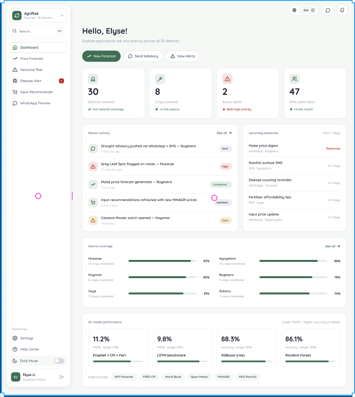
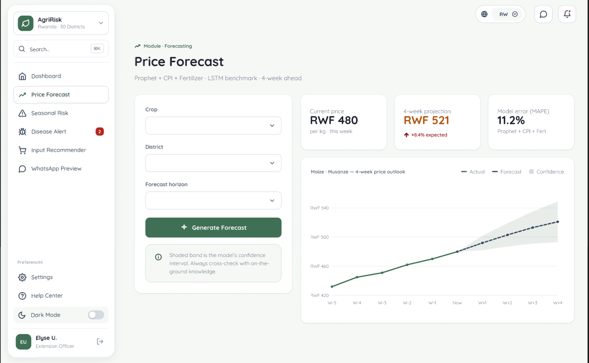
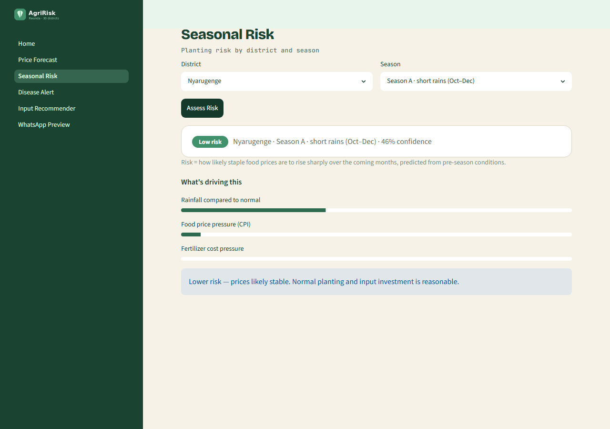
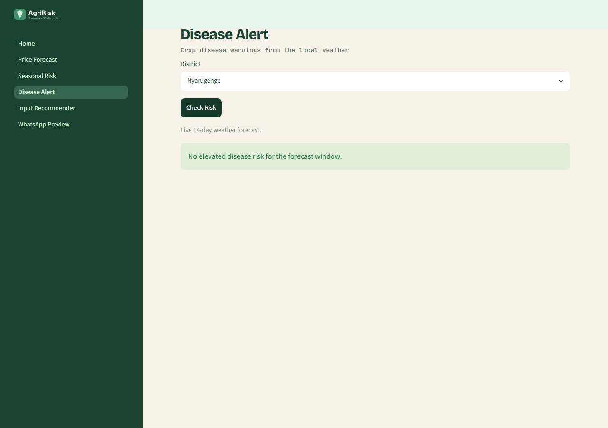
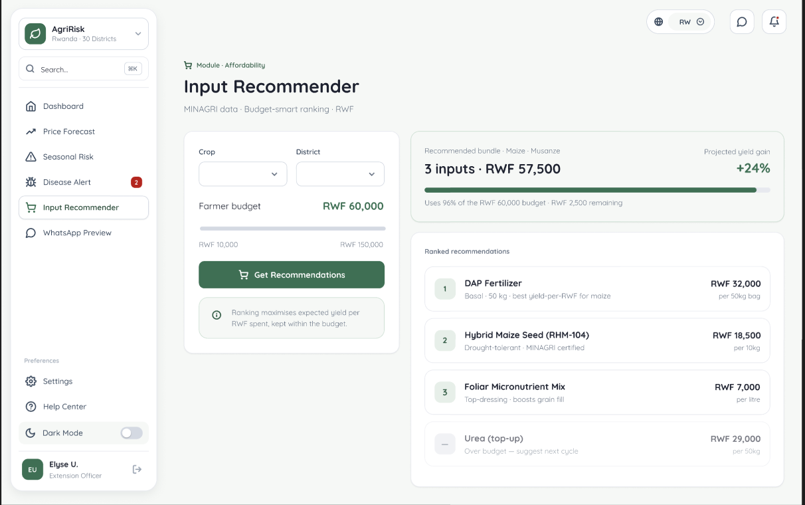
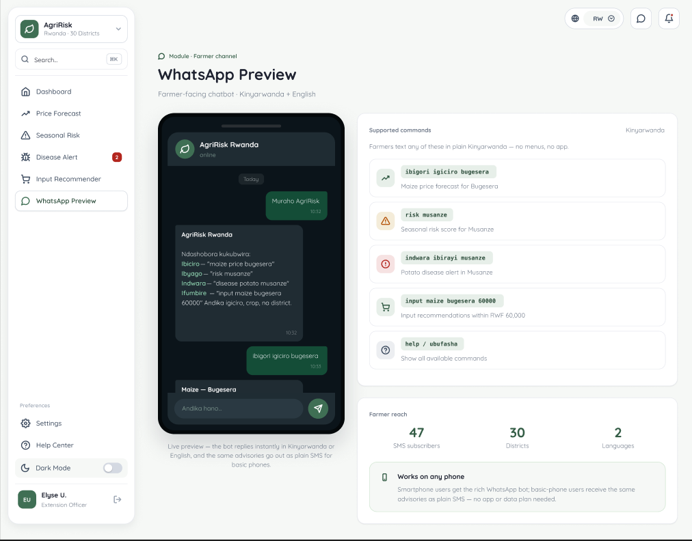

# AgriRisk Rwanda

## Description

AgriRisk Rwanda is a decision-support application for agricultural extension officers and
smallholder farmers. It brings four tools together for maize, beans, and Irish potatoes
across all 30 districts of Rwanda:

- **Crop price forecasting** for four weeks ahead, per crop and district.
- **Seasonal risk** rated low, medium, or high from rainfall, food inflation, and fertilizer cost.
- **Crop disease alerts** from live weather and FAO disease guidance.
- **Input recommender** that ranks affordable fertilizer for a chosen crop, district, and budget.

The application runs as a Streamlit dashboard with a farmer-facing WhatsApp chat in
Kinyarwanda and English. It is backed by trained machine learning models and a SQLite database.

## Repository

https://github.com/<your-username>/elyse-prototype

(Replace with your repository link before submission.)

## Setting up the environment and project

Requires Python 3.10 or newer.

```bash
git clone https://github.com/<your-username>/elyse-prototype.git
cd elyse-prototype

python -m venv venv
venv\Scripts\activate                 # Windows. macOS/Linux: source venv/bin/activate

pip install -r requirements.txt
python scripts/init_db.py             # create and seed the local database
streamlit run dashboard/Home.py
```

The dashboard opens at http://localhost:8501.

To rebuild the datasets from the raw public sources, place the source files in `data/raw/`
and run `pip install openpyxl xlrd xgboost` followed by `python scripts/prepare_data.py`.
Running the modelling notebook also needs `prophet`, `statsmodels`, and `tensorflow`,
which install most easily in Google Colab.

## Using the app

The sidebar holds six screens, reachable in one click:

- **Home** shows coverage, active alerts, delivery channels, and model performance.
- **Price Forecast** takes a crop and district and returns a four-week price estimate with a recommendation.
- **Seasonal Risk** takes a district and season and returns a risk rating with its contributing factors.
- **Disease Alert** takes a district and lists crop disease risks from the live weather forecast.
- **Input Recommender** takes a crop, district, and budget and returns ranked fertilizer options.
- **WhatsApp Preview** is a farmer chat that answers price, risk, disease, and input questions.

## Designs

Interface screenshots are in `docs/screenshots/`:








Figma mockup: <add your Figma link>

## Models

The modelling is documented in `notebooks/AgriRisk_Rwanda_Models.ipynb`, on real data:

- **Data visualization and engineering**: price distributions and trends, correlations, and the
  cleaning and feature steps for each source.
- **Model architecture**: the seasonal-risk classifier (random forest and XGBoost) and the price
  forecaster (ARIMA, Prophet, an LSTM with its layers, tanh activation, and Adam optimizer, and a
  random-forest baseline).
- **Performance metrics**: accuracy, precision, recall, and macro F1 for risk, and MAPE for price.

## Deployment plan

- **Prototype (now):** runs locally with Streamlit and a SQLite database, as described above.
- **Hosting:** deploy the dashboard to Streamlit Community Cloud or a small virtual server.
- **Database:** move from SQLite to the PostgreSQL schema in `src/db/schema.sql` for multi-user use.
- **Farmer channels:** connect the WhatsApp preview to the WhatsApp Business API through Twilio, and
  SMS to Africa's Talking.
- **Data refresh:** schedule `scripts/prepare_data.py` to update prices, inflation, fertilizer, and rainfall.

## Video demo

<add your 5 to 10 minute video link>

## Code files

```
.
├── dashboard/      Streamlit app (Home.py and pages/)
├── src/            models, data preparation, messaging channels, database
├── scripts/        data preparation, training, and database setup
├── notebooks/      modelling notebook with results
├── tests/          system tests
├── data/           raw and processed datasets, SQLite database
├── models_store/   trained models and metrics
├── config/         settings (crops, districts, paths)
├── assets/         logo
├── docs/           screenshots
└── requirements.txt
```

Run the system tests with `pip install pytest` then `pytest tests/test_system.py -v`.

## Tech stack

Python, Streamlit, scikit-learn, pandas, Prophet, statsmodels, TensorFlow, XGBoost, SQLite.
